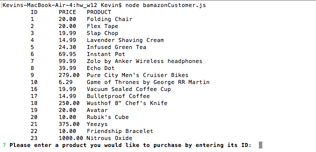
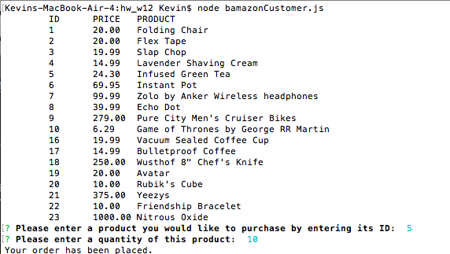
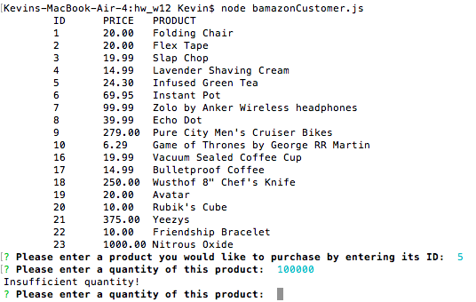
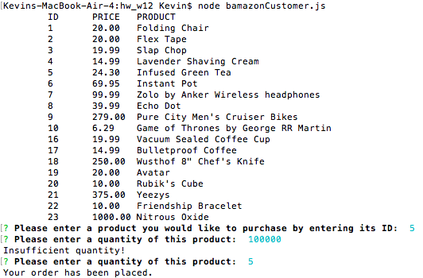
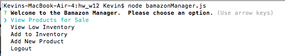
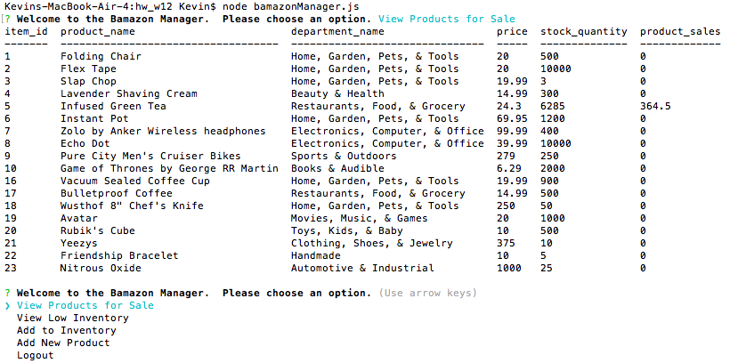
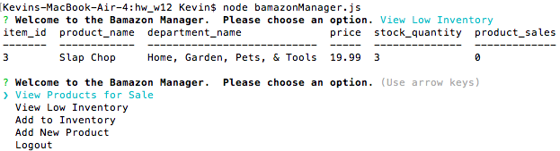
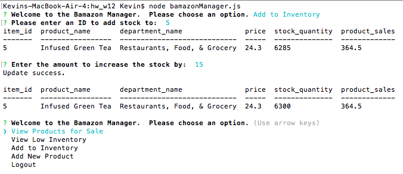
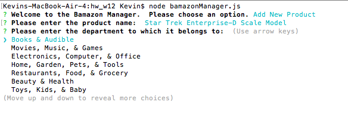
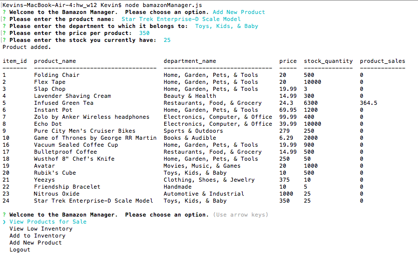

# Bamazon CLI App

#### An application to simulate a server that provides a customer shopping cart, inventory manager, and stock supervisor application

If running this application on a local machine, please be sure to
	`<npm install>`
before running the application.

## Customer CLI
The CLI that faces the customers is a straightforward application that prompts the customer to choose from the available products with an ID, then enter a quantity to purchase.

Below is the view the customer will see upon running the application:

### Successful Orders
Below is a view of a successful order being placed, which will update the table on the server:

### Failed Orders
If the customer inputs an invalid quantity, the table will not be updated, the customer will be alerted to insufficient quantity, and will be prompted to re-enter a valid quantity:

After entering a valid quantity, they will see the success screen as before:

## Manager CLI
The CLI that works from the same local server provides added functionality for a product manager to manage and view the products for sale, the stock for each product, as well as track the sales for each product.

Upon login, the manager CLI will display the following:

### View Products for Sale
Choosing the `View Products for sale` option will display product information:

### View Low Inventory
Choosing `View Low Inventory` will display products that are below a specified threshold (in this case a stock of 5):

### Add to Inventory
Choosing `Add to Inventory` will prompt the manager to choose a product to increase stock to, then display the updated value:

### Add New Product
Upon choosing `Add New Product` the manager will see below after entering a name for the product.  This list is pulled from the server's master list of departments:

After choosing a department to add the product to, they can specify the price per product and the stock they have:

